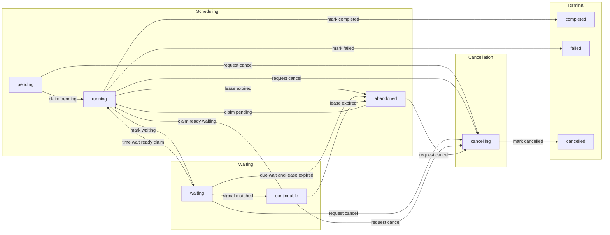

# Endurant State Machine

```mermaid
flowchart LR
  subgraph Scheduling
    pending
    running
    abandoned
  end

  subgraph Waiting
    waiting
    continuable
  end

  subgraph Cancellation
    cancelling
  end

  subgraph Terminal
    completed
    failed
    cancelled
  end

  pending -->|claim pending| running
  abandoned -->|claim pending| running
  running -->|lease expired| abandoned

  running -->|mark waiting| waiting
  waiting -->|signal matched| continuable
  waiting -->|time wait ready claim| running
  continuable -->|claim ready waiting| running
  waiting -->|due wait and lease expired| abandoned
  continuable -->|lease expired| abandoned

  pending -->|request cancel| cancelling
  running -->|request cancel| cancelling
  waiting -->|request cancel| cancelling
  continuable -->|request cancel| cancelling
  abandoned -->|request cancel| cancelling
  cancelling -->|mark cancelled| cancelled

  running -->|mark completed| completed
  running -->|mark failed| failed
```
